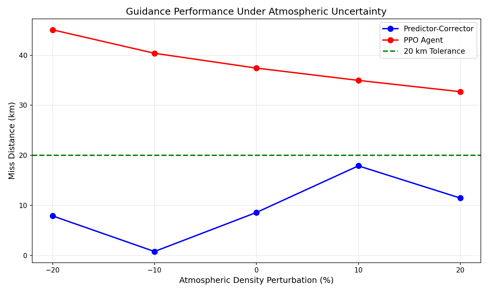

# Hypersonic Reentry Guidance through Hybrid Optimal Control and Reinforcement Learning

This project investigates guidance strategies for hypersonic reentry vehicles under strict path constraints. The core idea is to combine classical optimal control used to generate a reference trajectory with a deep reinforcement learning policy (PPO) that learns to track that reference under atmospheric uncertainty and sensor noise.

The motivation comes from the fact that classical predictor-corrector guidance methods, while reliable, are weak to dispersions in atmospheric density and vehicle aerodynamics. A learned policy trained with domain randomization can potentially generalize better across these uncertainties while still respecting hard physical constraints on heating, g-load, and dynamic pressure.

---

## Problem Statement

A lifting reentry vehicle enters the atmosphere at approximately 7,800 m/s from 120 km altitude (NASA.gov). The guidance system must modulate the bank angle to control the lift vector, shaping the trajectory to hit a downrange target while keeping the vehicle within a safe flight corridor defined by:

- Stagnation heat rate: <= 1500 kW/m²
- Normal load factor: <= 4 g
- Dynamic pressure: <= 50 kPa

---

## Approach

The project is structured in two phases. First, a reference trajectory is generated using a predictor-corrector scheme based on drag modulation. Second, a PPO agent is trained in a custom Gymnasium environment to track this reference under randomized initial conditions and atmospheric perturbations.

---

## Repository Structure

```
hypersonic-reentry-guidance/
├── dynamics/
│   └── reentry_dynamics.py        # 3DOF equations of motion, atmosphere model, constraint functions
├── envs/
│   └── reentry_env.py             # Custom Gymnasium environment for RL training
├── reference/
│   └── predictor_corrector.py     # Classical baseline guidance (to be implemented)
├── training/
│   └── train_ppo.py               # PPO training script using Stable Baselines3
├── results/                       # Saved models, training curves, trajectory plots
├── notebooks/
│   └── 01_dynamics_exploration.ipynb
├── requirements.txt
└── README.md
```

---

## Vehicle Parameters

| Parameter | Value |
|---|---|
| Vehicle class | Apollo-class lifting body |
| Mass | 2800 kg |
| Reference area | 12 m² |
| Drag coefficient | 1.2 |
| Lift-to-drag ratio | 0.25 |
| Nose radius | 0.3 m |
| Entry altitude | 120 km |
| Entry velocity | 7,800 m/s |
| Entry flight path angle | -5.5 deg |

---
## Update

### Phase 1 — Dynamics and Environment
- [x] 3DOF equations of motion (range-altitude plane)
- [x] Exponential atmosphere model
- [x] Chapman stagnation heating model
- [x] Custom Gymnasium environment with reward shaping
- [x] Baseline trajectory simulation and visualization

### Phase 2 — Reference Trajectory Generation
- [x] Predictor-corrector guidance baseline
- [x] Atmospheric uncertainty sensitivity analysis
- [x] Trajectory visualization and constraint verification

### Phase 3 — Reinforcement Learning Policy
- [x] PPO training on nominal environment
- [x] Domain randomization over atmospheric density and entry conditions
- [x] Policy evaluation against classical baseline

### Phase 4 — Analysis
- [x] Atmospheric uncertainty comparison (PC vs PPO)
- [x] Miss distance analysis across ±20% density perturbations

---

## Results

| Method | Nominal Miss | Miss at +10% Density | Consistency |
|---|---|---|---|
| Predictor-Corrector | 8.6 km | 17.9 km | Variable |
| PPO Agent (2M steps) | 37.6 km | 35.0 km | Very consistent |

The predictor-corrector achieves higher precision under nominal conditions.
The PPO agent demonstrates significantly more consistent behavior across
atmospheric perturbations, with miss distance varying by only ±6 km across
±20% density changes vs ±10 km for the classical method.

With additional training compute (10M+ steps), the PPO policy would likely
converge below the 20 km tolerance threshold while maintaining its robustness advantage.



## References

1. Vinh, N.X., Busemann, A., Culp, R.D. — *Hypersonic and Planetary Entry Flight Mechanics*, University of Michigan Press
2. Shen, Z., Lu, P. (2003) — *Onboard Generation of Three-Dimensional Constrained Entry Trajectories*
3. Chapman, D.R. (1958) — *An Approximate Analytical Method for Studying Entry into Planetary Atmospheres*, NACA TN-4276
4. Schulman, J. et al. (2017) — *Proximal Policy Optimization Algorithms*, arXiv:1707.06347
